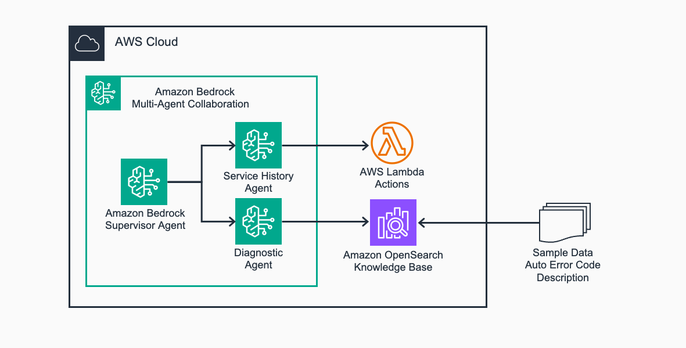

# sample-multi-agent-auto-service-assistant

This sample code respository provides an extendable concept on using Generative AI and multi-agent collabration to provide comprehensive service instructions for automotive service technician. This sample is intended to show Automotive industry a new way to enhance service output, improve vehicle owner satisfaction, and increase service bay througput.

## Sample Diagram


## Getting started

### Clone the repo and install python dependencies

Clone the repo:

```bash
git clone < this repo >
cd < this repo name >
```

To manually create a virtualenv on macOS and Linux:

```bash
python3 -m venv .venv
```

After the init process completes and the virtualenv is created, you can use the following
step to activate your virtualenv.

```bash
source .venv/bin/activate
```

Once the virtualenv is activated, you can install the required dependencies.

```bash
python3 -m pip install -r requirements.txt
```

### Turn On Model Access

Make sure you are in the region you'd like to deploy this sample.
Follow steps in [this article](https://docs.aws.amazon.com/bedrock/latest/userguide/model-access-modify.html) to request model access.
The initial model access has to go through AWS console.

Request access for following models:
* Titan Text Embeddings V2
* Claude 3.5 Sonnet v2

### Deploy the sample 

#### Setup AWS crednetials
If you have not already set up the AWS credentials, follow the steps here: [Installing the AWS CLI](https://docs.aws.amazon.com/cli/latest/userguide/getting-started-install.html) and [Configuring the AWS CLI](https://docs.aws.amazon.com/cli/latest/userguide/cli-chap-configure.html).

#### Deploy supporting components for the agents.
The agents will use one action group, implemented through one Lambda function, and one Bedrock Knowledgebase.

There are three scripts to run in total. Make sure you keep the region, prefix and suffix value the same throughput the steps.

To start, set input parameters up in environment variables:
```
export AWS_REGION=<your region> # example: expoert AWS_REGION=us-east-1
export PROJECT_PREFIX=<name of your workload> # example: expoert PROJECT_PREFIX=demo-asa
export PROJECT_SUFFIX=<unique 4-char identifier> # example: expoert PROJECT_SUFFIX=0000
```

Now in the same shell, run deployment scripts.

First, deploy action groups.
```
python3 deploy-action-groups.py
```

Second, deploy knowledge bases.
```
python3 deploy-knowledge-bases.py
```
Last, deploy the agents.
```
python3 deploy-multi-agents.py
```

Note down the name of the supervisor agent, you will use it in the next step.


### Test the agents
Now, you can see how multi-agents consolidate auto service information from both structured data and also pre-built knowledgebase.

For the ease of testing, use AWS console. 

Once logged into AWS console, go to Bedrock, Agents, and find the supervisor agent you deployed using the output from the previous step.

Use the test panel and start asking questions.
Example questions:

* "I have a 2022 hyundai tucson, last 5 digit of VIN is 2M4C6, it's engine light on. How do I proceed?"
* "The 2022 Hyundai Tucson' is giving OBD-II code P0342. What could be the issue?"

Notice the agent interacts and returns not only the diagnostic instruction, but also being situation-aware because it also considers service history of the car, based on service history data.

## Sample Code Structure
1. Agents: The instructions for each agent, and agent as collabrators are in `prompts` 
2. Knowledge Base: The sample knowledge articles for ingestion are in `sample-data-knowledge-base`. Note that in this sample repo, the articles are service notes on similar cars, representing the crowdsourced experience from technicians.
3. Action Groups: The action group action is implemented through Lambda, with Lambda code in directory `agent-action-groups/source`. The directory also contains service history data in csv format that agent reads in through the Lambda.

## Next Step
Now that you have deployed an agentic technician assistant, it's your turn to add more capabilities to it.

Take a look at the published [Guidance for Building an Automotive Technician with Multimodal Agentic AI on AWS](https://aws.amazon.com/solutions/guidance/building-an-automotive-technician-with-multimodal-agentic-ai-on-aws/) for a service technician assistant leverages advanced AI collaboration through AWS services to revolutionize vehicle and machine repairs, parts service and sales process, and warranty claim process.

## License
This project follow MIT-0 Open Source license.
